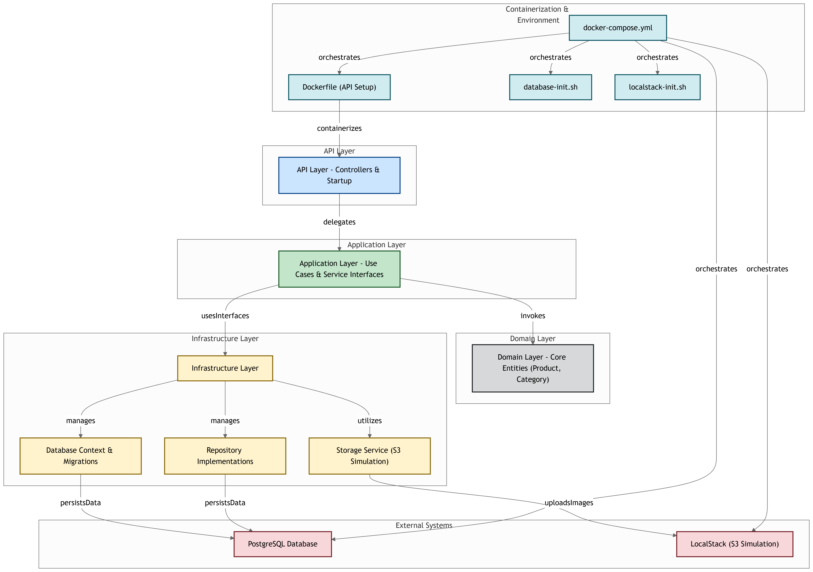

# 📦 Product Management API

API para gerenciamento de produtos, desenvolvida como parte de um desafio técnico, com arquitetura limpa, integração com banco de dados PostgreSQL e armazenamento de imagens simulando o serviço AWS S3 via LocalStack.

---

## 📐 Arquitetura do Projeto

O diagrama abaixo mostra como os componentes do sistema estão organizados em camadas, seguindo os princípios de Clean Architecture, e como eles se integram com serviços externos como PostgreSQL e LocalStack (S3 Simulation).

## 

## 📏 Padrões e Boas Práticas

Este projeto aplica os 5 princípios do SOLID:

- 💡 **SRP**: Cada componente do sistema tem uma responsabilidade única, facilitando a manutenção e evolução do código:
- `Controllers`: expõem endpoints HTTP e delegam a lógica para os UseCases.
- `DTOs`: encapsulam os dados de entrada e saída, além de conter validações específicas da camada de API.
- `UseCases`: concentram a lógica de negócio de cada operação.
- `Commands` e `Queries`: representam intenções claras de alterar ou consultar dados.
- `Repositories`: abstraem o acesso ao banco de dados.
- `Services`: tratam responsabilidades externas ou auxiliares.

---

- 💡 **OCP**: Componentes abertos para extensão e fechados para modificação:
  - `ApiResult<T>` e `Result<T>` permitem novos padrões de resposta sem alterar sua estrutura base.
  - DTOs possuem métodos como `ToCommand()` e `Validate()`, permitindo adicionar validações e conversões sem modificar a lógica existente.
  - Repositórios genéricos oferecem operações básicas reutilizáveis, enquanto repositórios específicos estendem o comportamento conforme necessário.
  - Interfaces como `IStorageService` facilitam a troca de implementações (ex: S3, Local) sem alterar os consumidores.

---

- 💡 **LSP**: Objetos derivados ou implementações concretas podem substituir suas abstrações sem alterar o comportamento esperado pelos consumidores:

  - `IProductRepository` pode ser substituído por `ProductRepository` sem quebrar os UseCases que a consomem.
  - `IStorageService` pode ser implementado por `S3StorageService` (produção) ou `LocalStorageService` (dev/teste), mantendo o contrato.
  - `IRequestValidator<T>` permite validar diferentes tipos de DTOs sem alterar os pontos que usam validação.
  - DTOs como `CreateProductRequest` e `UpdateProductRequest` implementam a interface `IRequestValidator`, permitindo que sejam usados de forma intercambiável por serviços que esperam um validador genérico, sem comprometer o comportamento esperado.

---

- 💡 **ISP**: Nenhum cliente deve ser forçado a depender de métodos que não utiliza
  - Interfaces como `IStorageService` e `IRequestValidator` são pequenas e específicas, permitindo que cada implementação dependa apenas dos métodos que realmente precisa.Isso evita acoplamento desnecessário e torna o código mais modular e fácil de manter.

---

- 💡 **DIP**: Dependa de abstrações, não de implementações concretas.
  - A aplicação depende apenas de abstrações, como `IProductRepository` e `IStorageService`, facilitando a inversão de controle e a testabilidade.  
    As implementações concretas são injetadas via Dependency Injection nas controllers e serviços.

### ✅ Command-Query Separation (CQS)

- **Comandos**: Alteram o estado da aplicação (ex: CreateProductCommand).
- **Consultas**: São apenas leitura (ex: GetAllProductsQuery).
- **Handlers**: Cada operação tem seu próprio handler.
  > ℹ️ O projeto não implementa CQRS completo, apenas a separação entre leitura e escrita (CQS).

---

### ✅ DTOs Específicos da Camada de API

- DTOs como CreateProductWithImageRequest encapsulam os dados de entrada.
- Possuem métodos ToCommand() e Validate(), facilitando a conversão para a camada de aplicação e a validação de dados.

---

### ✅ Record Types para Imutabilidade

- Utiliza record class em DTOs e Commands, promovendo imutabilidade.

---

### ✅ UseCases como Camada de Aplicação

- Cada operação é tratada em um UseCaseHandler, centralizando a lógica e desacoplando das controllers.

---

### ✅ Organização por Feature

- Diretórios separados por domínio: Product/Commands, Category/Queries, etc.
  Isso facilita a escalabilidade e o entendimento por contexto.

---

### ✅ ApiResult<T> como Wrapper de Resposta

- Todas as respostas seguem o mesmo padrão: sucesso, falha, mensagens e payloads consistentes.

---

### ✅ Upload de Arquivos Isolado

- Upload de imagens é tratado por um serviço externo (IStorageService), mantendo os Commands limpos.

---

## 📁 Estrutura de diretórios

```txt
src/ → Raiz
├─ ProductManagement.API → Web API (controllers, DI, configuração)
├─ ProductManagement.Application → UseCases e contratos de serviço
├─ ProductManagement.Domain → Entidades e lógica de negócio
└─ ProductManagement.Infrastructure → Repositórios  e serviços externos
```

---

## 🧰 Tecnologias Utilizadas

- ⚙️ [.NET 8](https://dotnet.microsoft.com/)
- 🐘 **PostgreSQL** via Docker
- ⚙️ **Entity Framework Core** (ORM e Migrations)
- ☁️ **Amazon S3** (simulado via [LocalStack](https://github.com/localstack/localstack))
- 🐳 **Docker & Docker Compose** (ambiente de desenvolvimento completo)
- 📘 **Swagger (Swashbuckle)** para documentação da API

---

## 🐳 Como rodar o projeto com Docker

### ✅ Pré-requisitos

- [Docker](https://www.docker.com/)
- [Docker Compose](https://docs.docker.com/compose/)

> ℹ️ **Dependências para o script `localstack-init.sh`:**  
> Para rodar o script que inicializa o ambiente LocalStack (como a criação do bucket `product-images`), é necessário ter:
>
> - [AWS CLI](https://docs.aws.amazon.com/cli/latest/userguide/install-cliv2.html) instalado
> - [awslocal](https://github.com/localstack/awscli-local) instalado (`pip install awscli-local`)
>
> O script `localstack-init.sh` executa comandos como `awslocal s3 mb s3://product-images`, portanto certifique-se de que essas ferramentas estão disponíveis no ambiente.

## 🐘 Inicialização do banco de dados

O script `database-init.sh` é executado automaticamente no container da API e é responsável por aplicar as migrations no banco PostgreSQL ao subir o ambiente com Docker.

⚠️ **Importante**:  
Esse script só roda corretamente se o banco de dados (`postgres`) estiver acessível na porta 5432. Ele usa o comando `nc` (netcat) para aguardar até que a conexão esteja disponível. Esse script é executado automaticamente via Dockerfile. Ele aplica as migrations e inicia a API logo em seguida.

### 📦Serviços via Docker

| Serviço           | Porta                    | Descrição                        |
| ----------------- | ------------------------ | -------------------------------- |
| ProductManagement | Http:8080 <br> Https:443 | API REST com suporte a Swagger   |
| PostgreSQL        | 5432                     | Banco de dados relacional        |
| LocalStack        | 4566                     | Simulador local dos serviços AWS |

> 💡 **Observação:**  
> A aplicação está rodando com **HTTPS** na porta **443** (com um certificado já incluído no projeto).  
> Redireciona automaticamente requisições HTTP (porta 8080) para HTTPS (porta 443).
> Você pode ter que aceitar o certificado na primeira vez que acessar via navegador.

### 🪣 Upload de Arquivos

- As imagens de produtos são armazenadas no bucket S3 **product-images** simulado no LocalStack.
- Durante a inicialização, o bucket é criado automaticamente via script.

### ▶️ Subindo os containers

1. Clone este repositório:

   ```bash
   git clone https://github.com/MarcosNasc/product-management-api.git
   cd product-management-api\src
   ```

2. Suba os containers com:

   ```bash
   docker-compose up --build
   ```

3. Acesse o Swagger da API em:

   ```bash
   http://localhost/swagger
   ```

## 📌 Autor

Desenvolvido por [Marcos Nascimento](https://github.com/marcosnasc)  
Desafio técnico para fins de avaliação e estudo.
